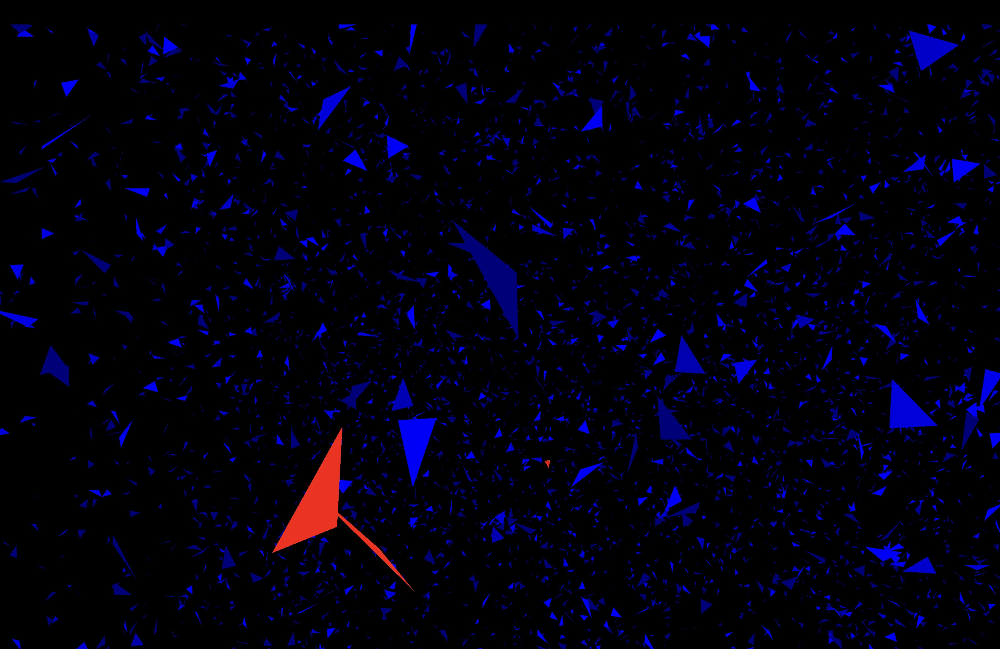
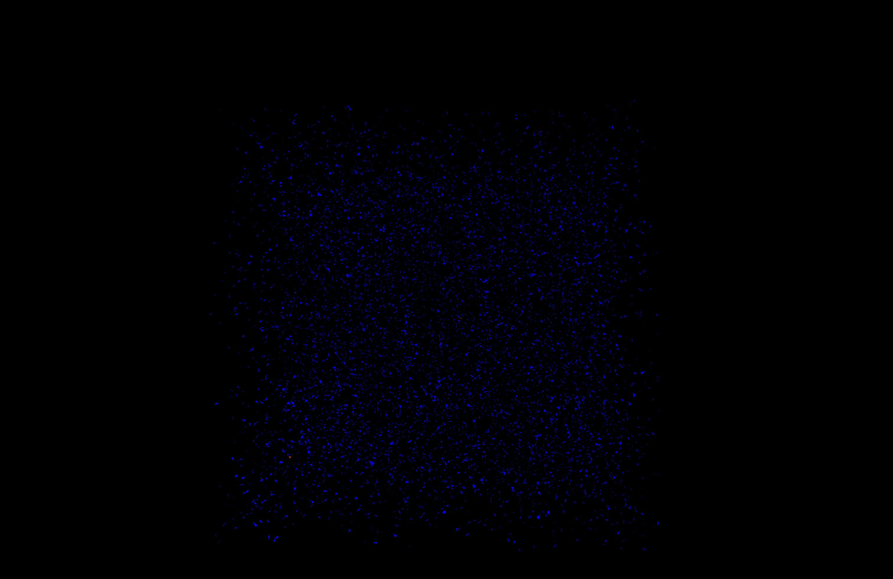

# Intersections_of_triangles

## 1 lvl
    This program intersects triangles in 3D and return numbers of intersected triangles.

## 2 lvl
    Representation triangles in 3D using Vulkan api with Chronus wrapper.
    In red color triangles that have intersect and in blue triangles that do not have.
    In this project Blinn-Phong model of ligtning was used.
    You can fly around triangles using wasd and mouse.
    (Rendering logic was separated from intersecting logic)


## Requirements 

The following applications have to be installed:

1. CMake 3.2 version (or higher)
2. GTest
3. g++
4. vulkan/vulkan.hpp
5. GLFW
6. GLM
7. Shader Compiler glslc

## Preview




## Compiling 

To compile you need to use Cmake in directory build:

``` 
mkdir build
cd build
сmake ..
```

To compile all: (tests and intersect)
```
make all
```


## Run the program:

You can find all binaries in dir build/bin

Intersection of triangles (you need to enter them)

By default number of require triangles equals 10000

```
./build/intersect
```


You can find example set of triangles in 

```
test/test.txt
```

## Test the program: 


Run tests:

```
./build/tests
```

